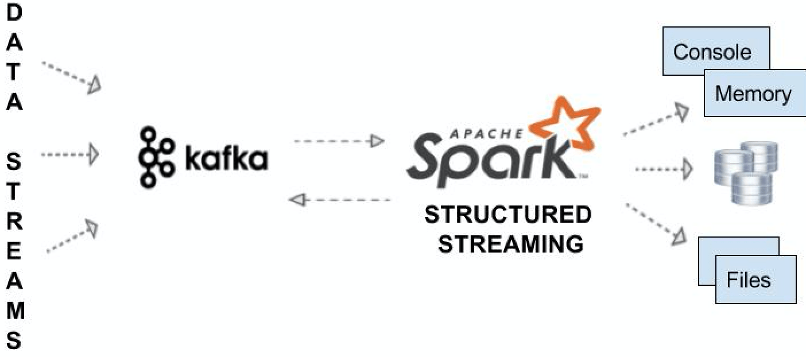

## **Análise de Dados de Sensores IoT em Tempo Real Usando Spark Streaming e Apache Kafka**

#### O objetivo deste projeto é analisar os dados oriundos de sensores IoT usando o Spark Streaming para essa análise e o Apache Kafka como middleware.
#### Após toda a arquitetura pronto iremos obter a temperatura média para cada sensor.

### Fonte de dados
#### Neste estudo vamos simular dados de sensores que medem a temperatura de máquinas ao logo do tempo. A geração randômica de dados é feito através de um código Python (simulador).

### Apache Kafka
#### O Apache Kafka é um plataforma de processamento de streams. O Kafka fornece uma plataforma unificada, de alta capacidade e baixa latência. 
#### Vale salientar que o Kafka não é uma plataforma de dados, de fato, ele não busca e nem envia dados. Ele recebe os dados e fica na espera que alguém venha buscar esses dados.
#### Mas por que usar o  Kafka neste projeto?
#### Podemos utilizar o Kafka para a extração, organização, processamento, segurança e persistência de dados em tempo real. Além do Spark Streaming ter um conector específico com o Kafka.
#### Apache Kafka trabalha com o conceito de tópicos (topics), que são logs de enventos.

### Utilizando o Apache Kafka
##### Os comandos deverão ser executados na pasta onde estão so binários do Kafka.
#### 1) Inicializar o Zookeeper, que é o erenciador de cluster do Kafka.
#### bin/zookeeper-server-start.sh config/zookeeper.properties

#### 2) Em outro terminal inicializar o Kafka:
#### bin/kafka-server-start.sh config/server.properties

#### 3) Em outro terminal criamos o tópico:
#### bin/kafka-topics.sh --create --topic dsamp6 --bootstrap-server localhost:9092

#### 4) Podemos descrever o tópico criado digitando o comando abaixo no mesmo terminal do passo 3:
#### bin/kafka-topics.sh --describe --topic dsamp6 --bootstrap-server localhost:9092